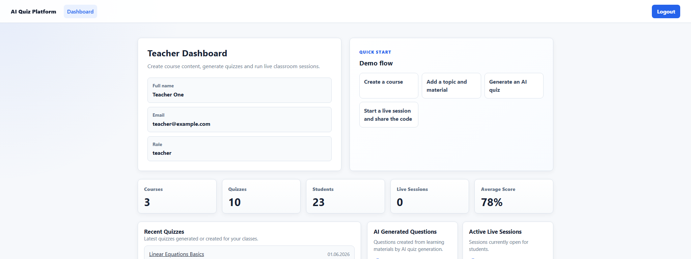
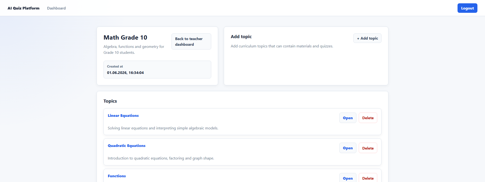
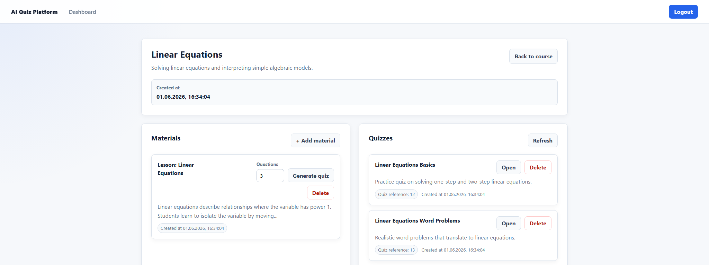
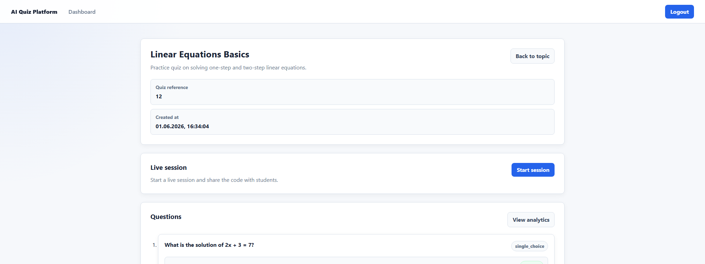
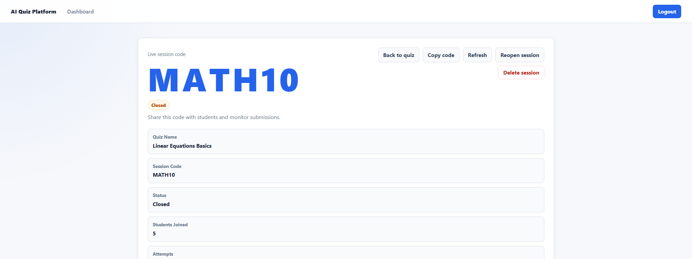
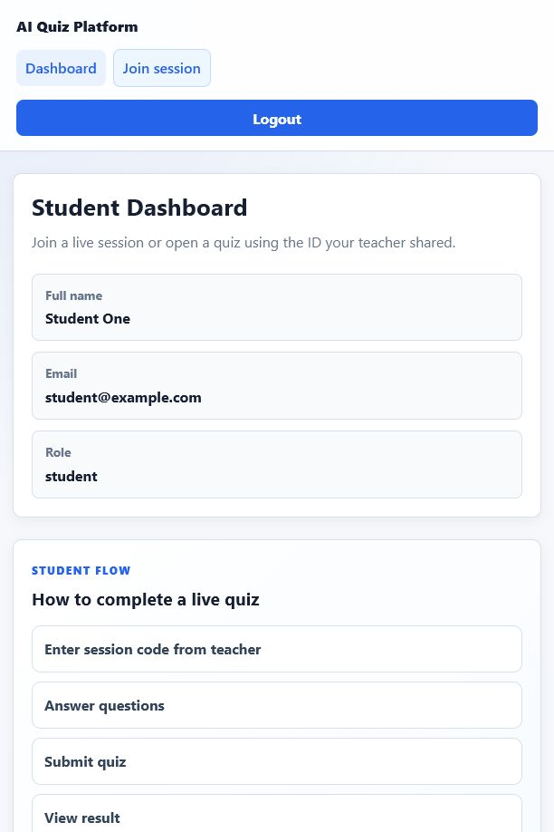
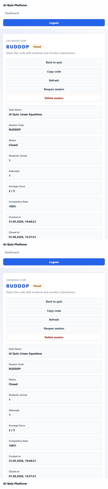

# AI Quiz Platform

A web platform for teachers and students that allows teachers to create courses, topics, materials, generate quizzes with AI, start live quiz sessions, and review student analytics.

## Tech Stack

### Frontend

- React
- TypeScript
- React Router
- Axios
- Vite

### Backend

- FastAPI
- SQLAlchemy
- Alembic
- JWT Authentication
- SQLite
- OpenAI API

## Features

- Teacher and student roles
- Register/Login
- JWT authentication
- Courses
- Topics
- Materials
- AI quiz generation
- Quiz passing
- Live sessions with session codes
- Student attempts
- Attempt results
- Session analytics
- Teacher dashboard
- Student dashboard
- Responsive UI

## Screenshots















## Project Structure

```text
.
├── app/                  # FastAPI backend application
│   ├── core/             # Configuration and security helpers
│   ├── db/               # Database session and SQLAlchemy base
│   └── modules/          # Auth, courses, topics, materials, quizzes, attempts, sessions
├── alembic/              # Database migrations
├── frontend/             # React + TypeScript frontend
│   └── src/
│       ├── api/          # Axios API clients
│       ├── auth/         # Token storage and auth types
│       ├── components/   # Layout, navbar, protected routes
│       ├── pages/        # App pages
│       ├── router/       # React Router config
│       └── styles/       # Global CSS
├── requirements.txt      # Backend dependencies
└── README.md
```

Note: the backend currently lives in the project root under `app/`, not inside a separate `backend/app` folder.

## Backend Setup

From the project root:

```bash
python -m venv .venv
```

Activate the virtual environment on Windows PowerShell:

```bash
.\.venv\Scripts\Activate.ps1
```

Install dependencies:

```bash
pip install -r requirements.txt
```

Create `.env` from the example:

```bash
copy .env.example .env
```

Apply migrations if needed:

```bash
alembic upgrade head
```

Start the FastAPI server:

```bash
uvicorn app.main:app --reload
```

Backend URL:

```text
http://127.0.0.1:8000
```

Swagger UI:

```text
http://127.0.0.1:8000/docs
```

Health check:

```text
GET /health
```

## Frontend Setup

```bash
cd frontend
```

Install dependencies:

```bash
npm install
```

Create `.env` from the example if needed:

```bash
copy .env.example .env
```

Start the frontend:

```bash
npm run dev
```

Frontend URL:

```text
http://localhost:5173
```

## Docker Setup

Run the full project with one command:

```bash
docker compose up --build
```

Frontend:

```text
http://localhost:5173
```

Backend Swagger UI:

```text
http://localhost:8000/docs
```

The Docker setup starts:

- FastAPI backend on port `8000`
- Vite frontend on port `5173`
- SQLite database stored in a Docker volume

The backend container runs Alembic migrations before starting Uvicorn.

To seed demo data inside Docker:

```bash
docker compose exec backend python scripts/seed_demo_data.py
```

## Environment Variables

`.env` files and API keys are not included in this repository.

Backend example:

```env
DATABASE_URL=sqlite:///./app.db
JWT_SECRET_KEY=your_secret_key_here
JWT_ALGORITHM=HS256
ACCESS_TOKEN_EXPIRE_MINUTES=60
OPENAI_API_KEY=your_openai_api_key_here
```

Frontend example:

```env
VITE_API_BASE_URL=http://127.0.0.1:8000
```

## Demo Flow

### Teacher

1. Register or login as a teacher.
2. Create a course.
3. Create a topic.
4. Add learning material.
5. Generate an AI quiz from the material.
6. Start a live session.
7. Share the session code with students.
8. View session analytics and student attempts.

### Student

1. Register or login as a student.
2. Join a live session with the teacher's session code.
3. Complete the quiz.
4. Submit answers.
5. View the result page.

## Demo Data Example

Course:

```text
Math Grade 10
```

Topic:

```text
Linear Equations
```

Material title:

```text
Theory for Linear Equations
```

Material content:

```text
Linear equation is an equation where the variable has power 1. Example: 2x + 3 = 7. To solve it, move constants to one side and divide by the coefficient of the variable.
```

## Demo Seed Data

To create a populated presentation dataset, run:

```bash
python scripts/seed_demo_data.py
```

Or inside Docker:

```bash
docker compose exec backend python scripts/seed_demo_data.py
```

The seed creates:

- 3 courses: Math Grade 10, Physics Grade 10, Biology Grade 10
- 8 realistic topics
- lesson materials for each topic
- 10 quizzes with questions and options
- live sessions with active and closed statuses
- realistic student attempts for analytics

Demo accounts:

```text
teacher@example.com / 12345678
student@example.com / 12345678
anna.student@example.com / 12345678
mark.student@example.com / 12345678
```

## Presentation Status

This is an MVP version created for demonstration and future SaaS development.

The current version focuses on the main education workflow:

- teacher content creation
- AI quiz generation
- live classroom sessions
- student quiz passing
- attempt results
- teacher analytics

## Important Notes

- `.env` files are ignored by Git.
- API keys are not included in this repository.
- Local database files are ignored by Git.
- Demo duplicates can be removed using Delete buttons in the teacher dashboard and topic pages.
